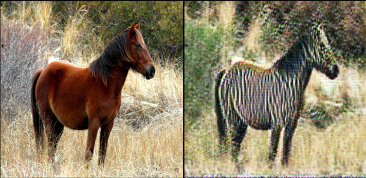
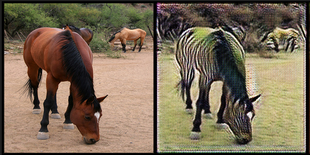

# Horse vs Zebra Image Transfer using CycleGAN

CycleGAN represents a significant advancement in image translation by sidestepping the requirement for paired datasets, instead leveraging unpaired images. This innovation alleviates the arduous task of meticulously matching samples. Through a blend of adversarial and cycle-consistency losses, CycleGAN achieves seamless translation between diverse image domains. Notably, it excels in preserving high-level semantic attributes, such as texture, color distribution, and shape characteristics, ensuring the fidelity and realism of the generated outputs. This capability extends beyond mere pixel-level mapping, enriching the translated images with nuanced features that enhance their visual coherence and authenticity.
## Project Overview

- **GAN Type**: CycleGAN
- **Discriminator Architecture**: PatchGAN
- **Generator Architecture**: UNET
- **Dataset**: Horse2Zebra
- **Learning Rate**: 1e-5
- **Lambda Consistency**: 10
- **Lambda Identity**: 5

## Dataset

Our efforts hinge on a carefully assembled dataset comprising a wide range of horse and zebra images gathered from diverse sources and collections. This unpaired dataset encompasses various poses, backgrounds, and environmental conditions, reflecting the inherent diversity within each domain. Before feeding the images into the network, we apply preprocessing steps such as resizing, normalization, and augmentation. These preparatory actions are aimed at ensuring consistency, stability, and generalization across the dataset, providing a solid basis for the ensuing training process.
## Code Overview

- `config`: Contains configuration parameters for the experiment.
- `wandb.init`: Initializes Weights & Biases for experiment tracking.
- `HorseZebraDataset`: Custom dataset class for loading horse and zebra images.
- `Discriminator`: Implements the discriminator network using PatchGAN architecture.
- `Generator`: Implements the generator network using UNET architecture.
- `train`: Contains training loop for CycleGAN.
- `test`: Contains code for testing the trained CycleGAN model.

## Results

## Acknowledgements

- This project is based on the CycleGAN paper by Jun-Yan Zhu et al.
- The Horse2Zebra dataset is provided by the authors of the CycleGAN paper.
- Weights & Biases is used for experiment tracking and visualization.

## License

This project is licensed under the MIT License - see the [LICENSE](LICENSE) file for details.
